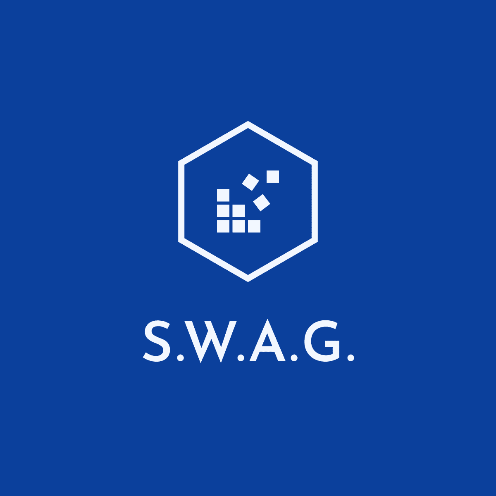

<!-- LOGO -->
 

    
  <h3 align="center">Smart Workforce Allocator Allocator Germany - SWAG</h3>

  

    #WirVsVirus Corona-Crisis Hackathon - organized by the German government
     
     
    <a href="">View Demo</a>
    ·
    <a href="">Get Involved</a>
  

## 🗂 Table of Contents

* [Problem Statement](#-problem-statement)
* [Solution](#-solution)
* [Unique Selling Point](#-unique-selling-point)
* [Get Involed](#-get-involved)
* [Contact](#-contact)
* [Acknowledgements](#-acknowledgements)

## 🤯 Problem Statement
> What exact problem are we trying to solve?

The corona-pandemic not only disrupted the global health system but also the global economy.
A variety of industry branches (e.g. hotels, travel agencies, etc) are getting bankrupt while others can't satisfy the peeking demand (e.g. grocery stores).
This leads to an extreme imbalance of a lot of idle, well qualified people, willing to work & help and on the other hand a massive number of companies, that have trouble getting employees to do the work - even forcing people to return from their vacation.
The current measures for short-time-work are **bureaucratic**, job agencies are **overloaded** and the information is **not transparent**.

## 🚀 Solution
> How are we trying to solve this problem?

SWA helps to mitigate this imbalance and directly connects employer and employees, building on the principles **ease of use**, **flexibility** & **optized allocation**.

## 🧪 Unique Selling Point
> What is unique about our approach

#### - Credibility -
SWA is built & run in collaboration with federal agencies, making it as credible as the government itself.
All users have  24hr the option to notify the administrators about suspicious behaviour or raise concers about certain incidents.
SWA tries to be as transparent as possible - a key driver in times of crisis.

#### - Flexibility  -
Both, employers and employees have the full freedom to specify their demands.
Even though the recommendation built on an optimized allocation, every user can make his own decisions based on personal preferences.

#### - Optimized Allocation -
The **secret sauce** of SWA is a **benevolent artificial intelligence** that tries to maximize the benefit for all parties (for further details of the problem domain you might want to take a look at [assignment problems](https://en.wikipedia.org/wiki/Assignment_problem) or [the adwords problem](http://infolab.stanford.edu/~ullman/mmds/ch8.pdf))

## 💪 Get Involed
> How can you help & get involved?

**As an employer** you simply follow these steps:
1. Register on the platform
2. Specify your workforce demands
3. Upload required scans & electronic documents
4. Get real time updates & notifications
5. Receive helping workforces

**As an employee** you simply follow these steps:
1. Register on the platform
2. Specify your qualifications & preferences
3. Get a list of up-to-date opportunities
4. Choose the suiting options
5. E-sign short-work contracts
6. Help with your workforce

## 🤓 Contact
> Who are we?

- [Lorena Schlesigner](https://github.com/lschlesinger)
- [Daniel Elsner](https://github.com/delsner)
- [Joshua Görner](https://github.com/jgoerner)
 
 ## 👍 Acknowledgements
 > Special thanks to...
 - F. Böhnke - Initial Idea
 - [Hatchful](https://hatchful.shopify.com/) - Easy Logo Generation
