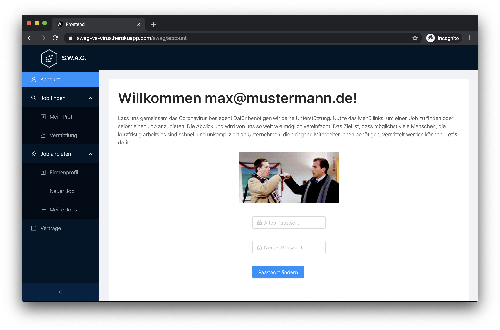
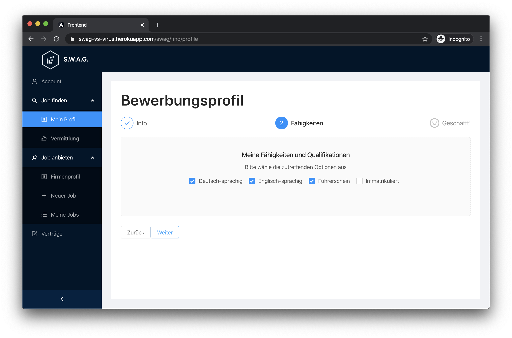
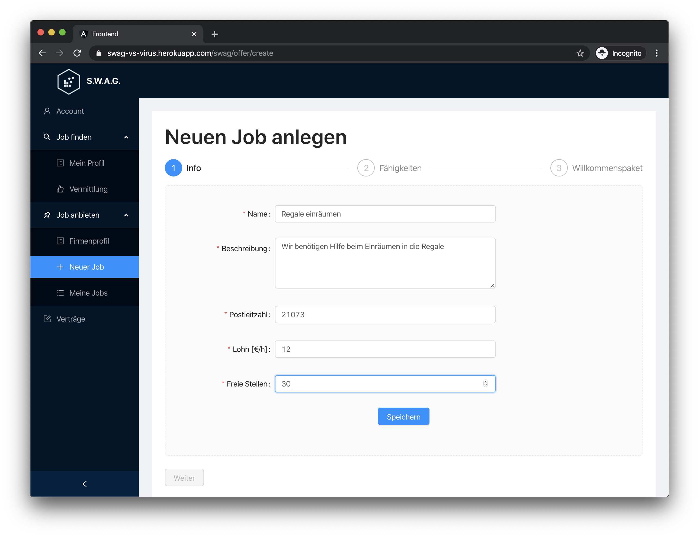
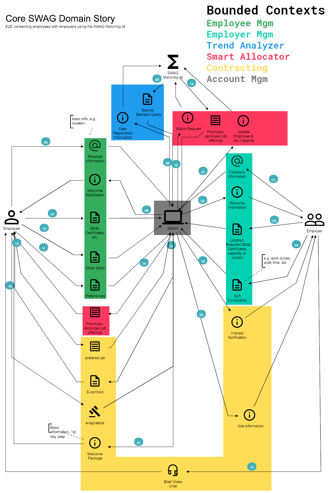

<!-- LOGO -->
 

    
  <h3 align="center">Smart Workforce Allocator Germany - SWAG</h3>

  

    #WirVsVirus Corona-Crisis Hackathon - organized by the German government
     
     
    <a href="https://swag-vs-virus.herokuapp.com/", target="_blank">View Demo</a>
    ·
    <a href="https://github.com/jgoerner/corona-hackathon/projects/1">Current Status</a>
    ·
    <a href="https://github.com/jgoerner/corona-hackathon/issues/new?assignees=&labels=&template=workpackage.md&title=">Get Involved</a>        
  

  

## 🗂 Table of Contents

* [Problem Statement](#-problem-statement)
* [Solution](#-solution)
* [Unique Selling Point](#-unique-selling-point)
* [User Stories](#-user-stories)
* [Technical Documentation](#-technical-documentation)
* [Get Involed](#-get-involved)
* [Contact](#-contact)
* [Acknowledgements](#-acknowledgements)

## 🤯 Problem Statement
> What exact problem are we trying to solve?

The corona-pandemic not only disrupted the global health system but also the global economy.
A variety of industry branches (e.g. hotels, travel agencies, etc) are getting bankrupt while others can't satisfy the peeking demand (e.g. grocery stores).
This leads to an extreme imbalance of a lot of idle, well qualified people, willing to work & help and on the other hand a massive number of companies, that have trouble getting employees to do the work - even forcing people to return from their vacation.
The current measures for short-time-work are **bureaucratic**, job agencies are **overloaded** and the information is **not transparent**.

## 🚀 Solution
> How are we trying to solve this problem?

SWAG helps to mitigate this imbalance and directly connects employer and employees, building on the principles **ease of use**, **flexibility** & **optimized allocation**.

<!-- in app screenshots -->

    <b>Homepage</b>
    

    <b>Refine Employee Profile</b>
    

    <b>Create Open Jobs</b>
    

## 🧪 UniqueSelling Point
> What is unique about our approach?

#### ⚡️ Batteries Included
> SWAG is all you need!

SWAG can be seen a one stop shop, support the whole process end to end.
There is no need to install other tools or register on other webpages.
To give just a few examples, SWAG includes...
- ... an **integrated document scanner** to easily save high quality scans of important qualifications & certificates
- ... **video chat** module to have a brief face to face conversation between employer & employee to clarify potential questions about the vacancies
- ... an **e-signature** module to allow the unbureaucratic handling of all contract related documents

#### 📊 Dynamic Trend Monitoring
> SWAG is more than a standard job portal!

SWAG utilizes combination of location and job offerings to individualize the onboarding process for potential employees.
If there is a specific demand in a certain region, SWAG will ask people who live in that region as well as ask new people who join SWAG about previous competencies on those topics.
These trend information can also be used by 3rd party services like the job center.

#### 🧠 Striving for a global equilibrium
> SWAG is smart!

SWAG is not only matching hard skill requirements. 
By taking into account the niche skills of individuals and certain jobs, SWAG is striving for a global optimum when matching job opportunities.
This does not mean that SWAG does not give you a choice.
You can make your own decision, SWAG only supports you to pick the most beneficial one.

## 🦄 User Stories
> What concrete user stories do we have in the current scope?

In order to make our solution approach a bit more tangible and down to earth, we are using [Domain Storytelling](https://domainstorytelling.org/).
All user stories can be found in the [`./doc/user-stories/`](./doc/user-stories) folder.
The following domain story is our main focus:

⚠️ **As the domain story is visually packed, you might want to download the [`.dst`](./doc/user-stories/data/core-domain-story-2020-03-20.dst) file and replay the story using the [Domain Story Modeler](https://www.wps.de/modeler/).**

## 📑 Technical Documentation
> What was the rationale behind certain decisions we've made?

In order to be as transparent as possible, and provide a clean and reproducible line of thought, we captured all our technological decision with the help of [Architecture Decision Records](https://github.com/joelparkerhenderson/architecture_decision_record) which you can find in the [`/doc/architecture`](./doc/architecture) folder.

## 💪 Get Involved
> How can you help & get involved?

We highly value any kind of feedback - technical or not technical.
The easiest way to provide us feedback is to use our [🎁 feedback issue template](https://github.com/jgoerner/corona-hackathon/issues/new?assignees=&labels=%F0%9F%8E%81+feedback&template=feedback.md&title=Feedback).
## 🤓 Contact
> Who are we?

- [Lorena Schlesigner](https://github.com/lschlesinger)
- [Floris Roltsch](https://github.com/floro91)
- [Daniel Elsner](https://github.com/delsner)
- [Joshua Görner](https://github.com/jgoerner)
 
 ## 👍 Acknowledgements
 > Special thanks to...
 - F. Böhnke - Initial Idea
 - [Hatchful](https://hatchful.shopify.com/) - Easy Logo Generation
