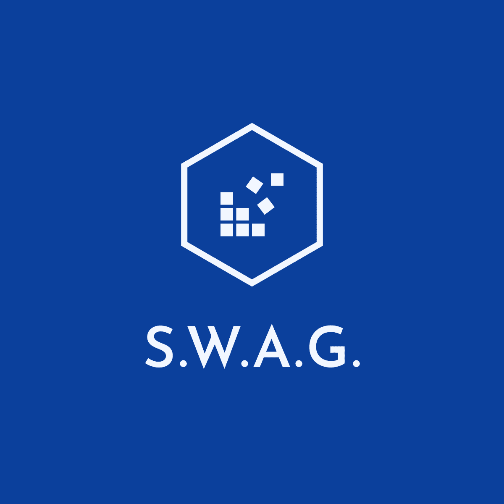

<!-- LOGO -->
 

    
  <h3 align="center">Corona-Hackathon</h3>

  

    #WirVsVirus Corona-Crisis Hackathon - organized by the German government
     
     
    <a href="">View Demo</a>
    ·
    <a href="">Get Involved</a>
  

## 🗂 Table of Contents

* [Problem Statement](#problem-statement)
* [Solution](#solution)
* [Unique Selling Point](#unique-selling-point)
* [Get Involed](#get-involved)
* [Contact](#contact)
* [Acknowledgements](#acknowledgements)

## 🤯 Problem Statement
> What exact problem are we trying to solve?

## 🚀 Solution
> How are we trying to solve this problem?

## 🧪 Unique Selling Point
> What is unique about our approach

## 💪 Get Involed
> How can you help & get involved?

## 🤓 Contact
> Who are we?

- [Lorena Schlesigner](https://github.com/lschlesinger)
- [Daniel Elsner](https://github.com/delsner)
- [Joshua Görner](https://github.com/jgoerner)
 
 ## 👍 Acknowledgements
 > Special thanks to...
 - F. Böhnke - Initial Idea
 - [Hatchful](https://hatchful.shopify.com/) - Easy Logo Generation
